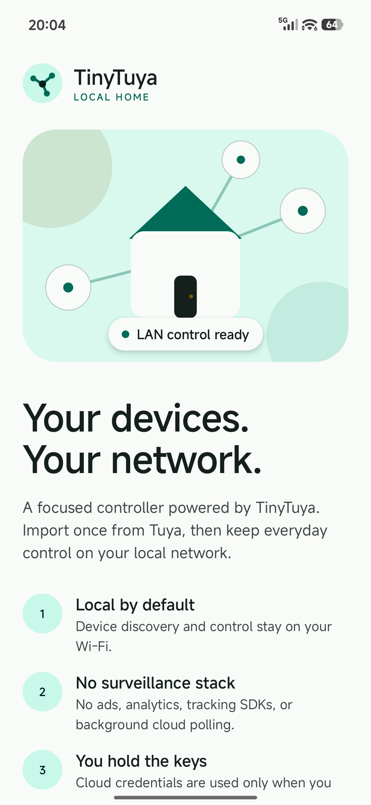
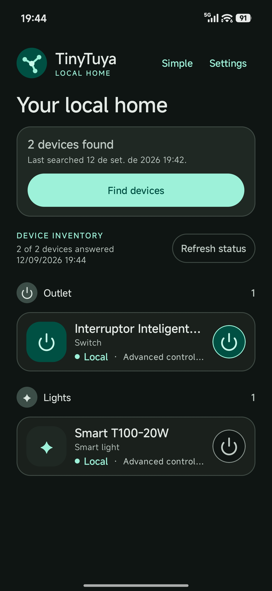
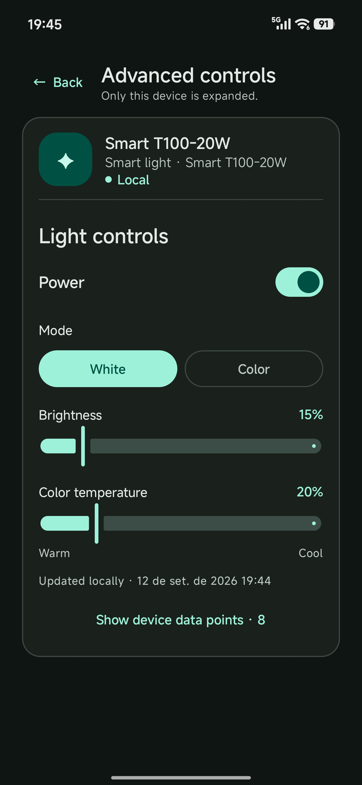

# TinyTuya Android

  

Tiny way to control <b>some</b> Tuya devices locally using Android

  

  &nbsp;&nbsp;&nbsp;
  &nbsp;&nbsp;&nbsp;
  

### Requirements
- Android 10+ and a [supported Tuya device](docs/SUPPORTED_DEVICES.md).
- Follow the setup steps below.

### Setup
TinyTuya needs each device's ID, local key, and data point mappings, and that information exists only in your Tuya Cloud account. A cloud import fetches it once, and afterwards everyday use is purely local. You only need to repeat it when you add devices or re-pair them (re-pairing resets the local key).
So, you need to pair your devices using Smart Life or Tuya Smart, then create a Tuya Developer Platform account, link Smart Life or Tuya Smart to your Tuya Developer Plaform account to import your devices, only then you can use TinyTuya Android. Follow the setup steps [here](docs/TUYA_CLOUD.md).

### Know issues
- Some Tuya devices are unreliable to control locally, they might refuse to respond after a while as described [here](https://github.com/jasonacox/tinytuya/discussions/443).

### Special thanks
- TinyTuya Android is based on @jasonacox [TinyTuya](https://github.com/jasonacox/tinytuya/tree/master) Python library.
- The excellent [Chaquopy SDK](https://chaquo.com/chaquopy/) that allows me to run Python on Android without headaches.

### License
<pre>
Copyright (c) 2026 Paulo de Castro

Permission is hereby granted, free of charge, to any person obtaining a copy
of this software and associated documentation files (the "Software"), to deal
in the Software without restriction, including without limitation the rights
to use, copy, modify, merge, publish, distribute, sublicense, and/or sell
copies of the Software, and to permit persons to whom the Software is
furnished to do so, subject to the following conditions:

The above copyright notice and this permission notice shall be included in all
copies or substantial portions of the Software.

THE SOFTWARE IS PROVIDED "AS IS", WITHOUT WARRANTY OF ANY KIND, EXPRESS OR
IMPLIED, INCLUDING BUT NOT LIMITED TO THE WARRANTIES OF MERCHANTABILITY,
FITNESS FOR A PARTICULAR PURPOSE AND NONINFRINGEMENT. IN NO EVENT SHALL THE
AUTHORS OR COPYRIGHT HOLDERS BE LIABLE FOR ANY CLAIM, DAMAGES OR OTHER
LIABILITY, WHETHER IN AN ACTION OF CONTRACT, TORT OR OTHERWISE, ARISING FROM,
OUT OF OR IN CONNECTION WITH THE SOFTWARE OR THE USE OR OTHER DEALINGS IN THE
SOFTWARE.

</pre>

